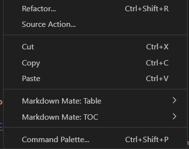
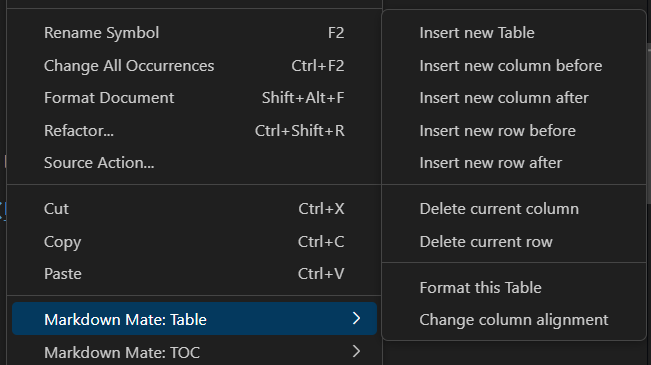
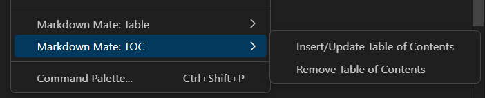

# Markdown Mate

Markdown Mate is a VS Code pluin that allows you to easily create and edit markdown files using context menu, command palette and shortcuts.
With Markdown Mate, you can:

- Generate Table of Contents
- Insert and modify tables
- Format text

## Table of Contents<!-- TOC ignore -->

<!-- TOC -->

- [Context Menu](#context-menu)
  - [Markdown Mate: Table](#markdown-mate-table)
  - [Markdown Mate: TOC](#markdown-mate-toc)
- [Shortcuts](#shortcuts)
- [Commands](#commands)
- [Future plans](#future-plans)

<!-- /TOC -->

## Context Menu

Context menu is the preferred way to use this plugin for TOC and Tables.
When a markdown file is opened in editor, right click on it to reveal the menu.

Menu has been grouped in submenu:

- Markdown Mate: Table
- Markdown Mate: TOC

### Markdown Mate: Table

This submenu contains commands for table related operations:

- Insert new Table
- Insert new column before
- Insert new column after
- Insert new row before
- Insert new row after
- Delete current column
- Delete current row
- Format this table
- Change column Alignment

### Markdown Mate: TOC

This submenu contains commands for TOC related operations:

- Insert/Update Table of Contents
- Remove Table of Contents
- Include/Exclude this header from TOC

## Shortcuts

- `Ctrl + Shift + B` - Toggle **Bold**
- `Ctrl + Shift + I` - Toggle _Italic_
- `` Ctrl + `  `` - Toggle `inline code`
- `` Ctrl + Shift + `  `` - Toggle code block
- `Ctrl + Shift + Q` - Toggle blockquote

## Commands

You may use all the commands from Command Palette too. Open VS Code command palette using `Ctrl + Shift + P`, then search for the following commands:

- Insert/Update Table of Contents
- Remove Table of Contents
- Include/Exclude this header from TOC
- Insert a Table
- Format this Table
- Insert new row before
- Insert new row after
- Insert new column before
- Insert new column after
- Delete current column
- Delete current row
- Change column alignment

## Future plans

- Show better warnings
- Add test cases
